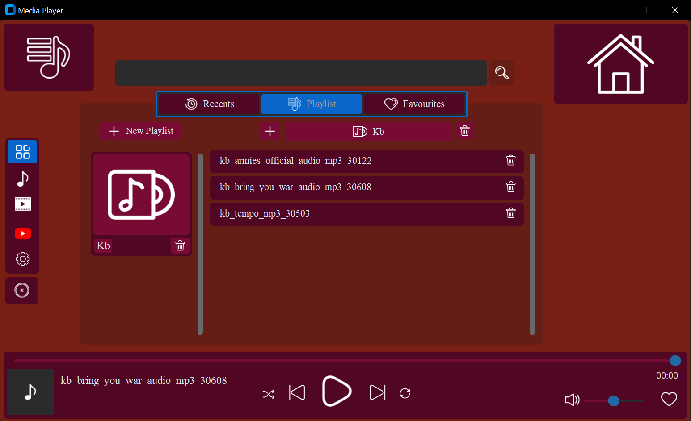

# **Media-Player-Desktop-App**
In this project Python has been used to create an application that not only plays video and audio but also downloads videos and audios from You Tube. Try it out and feel free to write a review.

## **Installation**
**Note:** This program has only been tested in Windows and also ensure that you download the vlc 64 bit version using the link provided below.
- Install **[Python 3.10.12](https://www.python.org/downloads/release/python-31012/)**
- Install **[vlc](https://get.videolan.org/vlc/3.0.18/win64/vlc-3.0.18-win64.exe)**
- Open the command prompt and run the following command:
 ``` 
  pip3 install -r requirements.txt 
  ```
Run ` MediaPlayer.py ` to start the app. Enjoy!

## **Overview**



## **Features**
- Plays audio and video
- Playlist functionalities
- Downloads audio and video from You Tube

### Keyboard shortcuts
- ` Spacebar ` - play or pause video
- ` Right arrow ` - fast forward the video 
- ` Left arrow ` - rewind the video

### Improvements
- Better UI
- Addition of a loop feature
- Addition of a shuffle feature

### Credit
All icons have been provided by [FlatIcon](https://www.flaticon.com/)